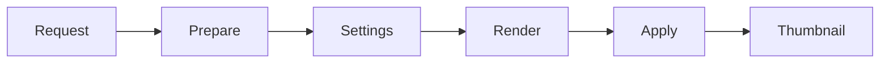

# Code Heavy Fixture

This fixture focuses on fenced code blocks for syntax highlighting and block rendering.

```swift
import Foundation

struct PreviewTiming {
    let phase: String
    let duration: TimeInterval
}

let timing = PreviewTiming(phase: "render", duration: 0.042)
print("\(timing.phase): \(timing.duration)")
```

```python
from dataclasses import dataclass

@dataclass
class PreviewTiming:
    phase: str
    duration: float

timing = PreviewTiming("prepare", 0.018)
print(f"{timing.phase}: {timing.duration:.3f}")
```

```javascript
const timings = [
  { phase: "request", duration: 12 },
  { phase: "render", duration: 44 },
];

const total = timings.reduce((sum, item) => sum + item.duration, 0);
console.log(`total: ${total}ms`);
```

```bash
#!/usr/bin/env bash
set -euo pipefail

fixture="Fixtures/Performance/code-heavy.md"
wc -l "$fixture"
```


