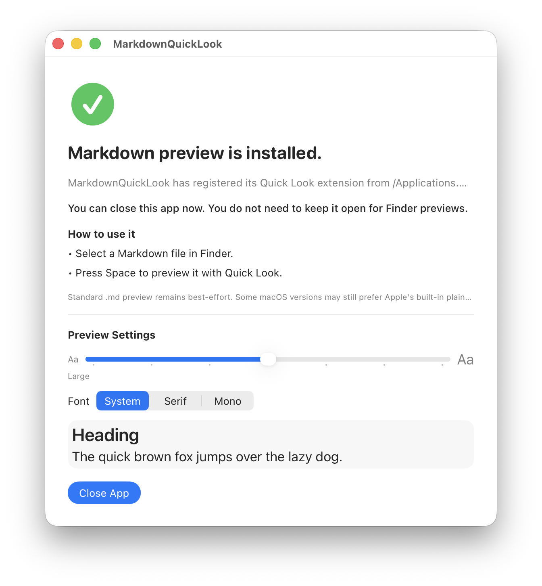
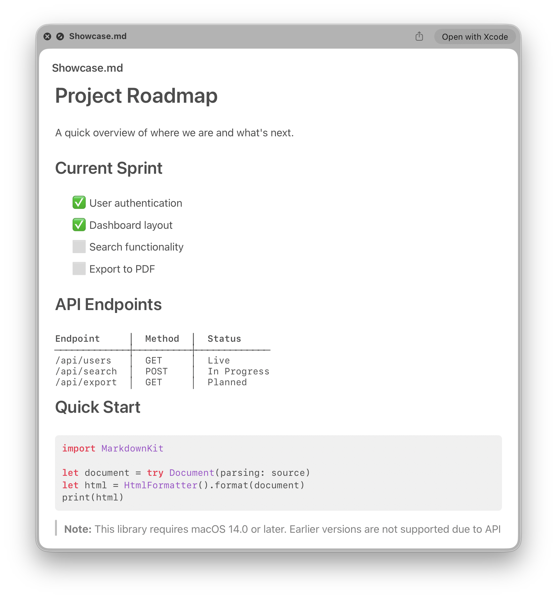

# Markdown Quick Look

[](https://github.com/rkaregaran/MarkdownQuickLook/actions/workflows/release.yml)
[](https://github.com/rkaregaran/MarkdownQuickLook/releases/latest)
[](https://github.com/rkaregaran/MarkdownQuickLook/releases/latest)
[](https://github.com/rkaregaran/MarkdownQuickLook/blob/main/LICENSE)
[](https://github.com/rkaregaran/MarkdownQuickLook/blob/main/PRIVACY.md)
[](https://github.com/rkaregaran/MarkdownQuickLook#install)

Markdown Quick Look is a macOS Quick Look app for previewing standard Markdown files in Finder.
It requires macOS 14.0 or newer.

It is best effort for regular `.md` files, which means Finder may not always pick it over the built-in plain-text preview.





## Install

[Download latest release](https://github.com/rkaregaran/MarkdownQuickLook/releases/latest)

1. Download `MarkdownQuickLook-macOS.zip` from GitHub Releases.
2. Unzip it.
3. Drag `MarkdownQuickLook.app` into `/Applications`.
4. Open `MarkdownQuickLook.app` once, then click `Close App`. You should not need to open it again after that first successful launch.

## Use

1. Select a `.md` file in Finder.
2. Press `Space`.

## Important Caveats

Finder may still prefer Apple's built-in plain-text preview on some macOS versions.

**"Would like to access data from other apps" dialog:** macOS may show this prompt when the app or its Quick Look extension accesses shared settings stored in an App Group container. This is a standard macOS privacy feature — the app stores your preview preferences (text size, font) in a shared container so the Quick Look extension can read them. Clicking "Allow" lets the app save and load these settings. This prompt appears once per session for non-App Store builds; App Store builds suppress it automatically.

## Development

Requirements:

- Xcode 26.1.1 or newer
- XcodeGen 2.45.3 or newer

Generate and open the project:

```bash
xcodegen generate
open MarkdownQuickLook.xcodeproj
```

Run the local preview flow:

```bash
./Scripts/dev-preview.sh
```

Build a release package:

```bash
./Scripts/build-release.sh
```

## Automated Releases

Every push to `main` creates a new rolling GitHub release through GitHub Actions.
Each release uploads `MarkdownQuickLook-macOS.zip`, which expands to `MarkdownQuickLook.app` and `LICENSE`.

Local release packaging is still available with:

```bash
./Scripts/build-release.sh
```

## Notarization & App Store Distribution

### Prerequisites

You need two certificates from your Apple Developer account:

- **Developer ID Application** — for notarized GitHub releases (direct distribution)
- **Apple Distribution** — for Mac App Store submission

### Creating a Developer ID Application Certificate

1. Open **Keychain Access** (Spotlight > "Keychain Access").
2. Menu: **Keychain Access > Certificate Assistant > Request a Certificate From a Certificate Authority**.
3. Fill in your email address, leave CA Email blank.
4. Select **"Saved to disk"** and save the `.certSigningRequest` file.
5. Go to https://developer.apple.com/account/resources/certificates/list.
6. Click **+**, select **Developer ID Application** under Software, click Continue.
7. Upload the `.certSigningRequest` file and download the resulting `.cer` file.
8. Double-click the `.cer` file to install it into Keychain Access.
9. Verify: `security find-identity -v -p codesigning | grep "Developer ID Application"`

### Creating an App Store Connect API Key

1. Go to https://appstoreconnect.apple.com/access/integrations/api.
2. Click **Generate API Key** (or **+**).
3. Name: `MarkdownQuickLook CI`, Access: **Developer**.
4. Click Generate and **download the `.p8` file immediately** (one-time download).
5. Note the **Key ID** and the **Issuer ID** at the top of the page.

### CI Secrets for Notarized Releases

Add these secrets at your repository's Settings > Secrets and variables > Actions:

| Secret | Value |
|---|---|
| `DEVELOPER_ID_CERT_BASE64` | `.p12` export of Developer ID Application certificate, base64-encoded (`base64 -i cert.p12 \| pbcopy`) |
| `DEVELOPER_ID_CERT_PASSWORD` | Password used when exporting the `.p12` |
| `NOTARY_KEY` | Full contents of the `.p8` API key file |
| `NOTARY_KEY_ID` | Key ID from App Store Connect |
| `NOTARY_ISSUER_ID` | Issuer ID from App Store Connect |
| `KEYCHAIN_PASSWORD` | Any random string (e.g., `openssl rand -base64 24`) |
