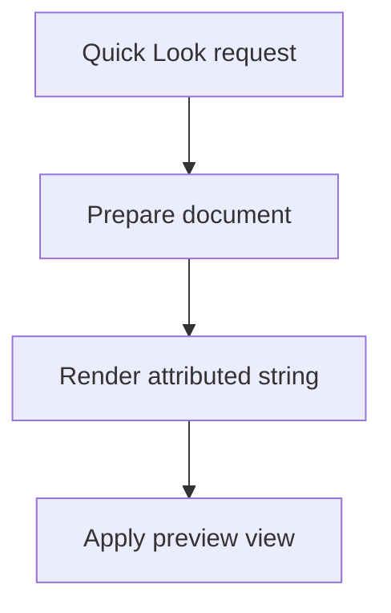

# Performance Instrumentation Implementation Plan

> **For agentic workers:** REQUIRED SUB-SKILL: Use superpowers:subagent-driven-development (recommended) or superpowers:executing-plans to implement this plan task-by-task. Steps use checkbox (`- [ ]`) syntax for tracking.

**Goal:** Add local developer instrumentation that makes Markdown Quick Look preview, renderer, and thumbnail performance measurable with Instruments and repeatable fixtures.

**Architecture:** Add a tiny shared instrumentation wrapper in `MarkdownRendering` so the preview extension, thumbnail extension, and renderer can all use the same debug-only signpost API. Instrument the real Quick Look request flow first, then add renderer and thumbnail spans, committed fixtures, and a local setup script for repeatable profiling.

**Tech Stack:** Swift 5, AppKit, Quick Look preview/thumbnail extensions, `OSLog` signposts, XcodeGen, `xcodebuild`, zsh.

---

## File Structure

Create:

- `MarkdownRendering/Sources/MarkdownPerformanceInstrumentation.swift`: shared debug-only signpost and debug-log facade.
- `Fixtures/Performance/small.md`: README-sized baseline fixture.
- `Fixtures/Performance/large.md`: prose/list-heavy fixture.
- `Fixtures/Performance/code-heavy.md`: fenced code fixture.
- `Fixtures/Performance/table-heavy.md`: table fixture.
- `Fixtures/Performance/image-heavy.md`: local and missing image fixture.
- `Fixtures/Performance/mixed-realistic.md`: mixed real-world fixture.
- `Scripts/profile-performance.sh`: local setup script for profiling with Instruments.

Modify:

- `MarkdownRendering/Tests/SmokeTests.swift`: smoke-test instrumentation calls.
- `MarkdownRendering/Sources/MarkdownDocumentRenderer.swift`: renderer, parse, inline, code, image, and table spans.
- `MarkdownQuickLookPreviewExtension/PreviewViewController.swift`: end-to-end preview request, settings, render, apply, cancel, stale, and failure spans.
- `MarkdownQuickLookThumbnailExtension/ThumbnailProvider.swift`: thumbnail request, prepare, render, draw, and failure spans.

Do not modify:

- `PRIVACY.md`: this work is local developer debugging only and adds no production telemetry.
- Release packaging behavior except for including the new source/script/fixtures in the repository.

---

### Task 1: Add Shared Instrumentation Facade

**Files:**

- Create: `MarkdownRendering/Sources/MarkdownPerformanceInstrumentation.swift`
- Modify: `MarkdownRendering/Tests/SmokeTests.swift`

- [ ] **Step 1: Add the instrumentation facade**

Create `MarkdownRendering/Sources/MarkdownPerformanceInstrumentation.swift` with this exact content:

```swift
import Foundation
import OSLog

public enum MarkdownPerformanceInstrumentation {
    public struct Interval {
        #if DEBUG
        fileprivate let name: StaticString
        fileprivate let id: OSSignpostID

        fileprivate init(name: StaticString, id: OSSignpostID) {
            self.name = name
            self.id = id
        }
        #else
        fileprivate init() {}
        #endif
    }

    #if DEBUG
    private static let signpostLog = OSLog(
        subsystem: "com.rzkr.MarkdownQuickLook",
        category: .pointsOfInterest
    )

    private static let logger = Logger(
        subsystem: "com.rzkr.MarkdownQuickLook",
        category: "performance"
    )
    #endif

    @discardableResult
    public static func begin(_ name: StaticString) -> Interval {
        #if DEBUG
        let id = OSSignpostID(log: signpostLog)
        os_signpost(.begin, log: signpostLog, name: name, signpostID: id)
        return Interval(name: name, id: id)
        #else
        return Interval()
        #endif
    }

    public static func end(_ interval: Interval) {
        #if DEBUG
        os_signpost(.end, log: signpostLog, name: interval.name, signpostID: interval.id)
        #endif
    }

    public static func event(_ name: StaticString) {
        #if DEBUG
        os_signpost(.event, log: signpostLog, name: name)
        #endif
    }

    public static func debug(_ message: @autoclosure () -> String) {
        #if DEBUG
        logger.debug("\(message(), privacy: .public)")
        #endif
    }
}
```

- [ ] **Step 2: Add an inert-call smoke test**

In `MarkdownRendering/Tests/SmokeTests.swift`, replace the file with:

```swift
import XCTest
@testable import MarkdownRendering

final class SmokeTests: XCTestCase {
    func testRendererInitializes() {
        XCTAssertNotNil(MarkdownDocumentRenderer())
    }

    func testPerformanceInstrumentationCanBeCalledFromTests() {
        let interval = MarkdownPerformanceInstrumentation.begin("test.instrumentation")
        MarkdownPerformanceInstrumentation.event("test.instrumentation.event")
        MarkdownPerformanceInstrumentation.debug("test instrumentation debug line")
        MarkdownPerformanceInstrumentation.end(interval)
    }
}
```

- [ ] **Step 3: Run the rendering tests**

Run:

```bash
xcodegen generate
xcodebuild -project MarkdownQuickLook.xcodeproj -scheme MarkdownRenderingTests -destination 'platform=macOS' test
```

Expected: `** TEST SUCCEEDED **`.

- [ ] **Step 4: Commit**

Run:

```bash
git add MarkdownRendering/Sources/MarkdownPerformanceInstrumentation.swift MarkdownRendering/Tests/SmokeTests.swift
git commit -m "feat: add debug performance instrumentation facade"
```

---

### Task 2: Instrument Renderer Preparation And Rendering

**Files:**

- Modify: `MarkdownRendering/Sources/MarkdownDocumentRenderer.swift`
- Test: `MarkdownRendering/Tests/MarkdownDocumentRendererTests.swift`

- [ ] **Step 1: Instrument `prepareDocument(fileAt:)`**

In `MarkdownRendering/Sources/MarkdownDocumentRenderer.swift`, replace `prepareDocument(fileAt:)` with:

```swift
public func prepareDocument(fileAt url: URL) throws -> MarkdownPreparedDocument {
    let prepareInterval = MarkdownPerformanceInstrumentation.begin("renderer.prepareDocument")
    defer { MarkdownPerformanceInstrumentation.end(prepareInterval) }

    try throwIfCancelled()
    let source: String

    do {
        let readInterval = MarkdownPerformanceInstrumentation.begin("renderer.readFile")
        defer { MarkdownPerformanceInstrumentation.end(readInterval) }
        source = try String(contentsOf: url, encoding: .utf8)
    } catch {
        MarkdownPerformanceInstrumentation.event("renderer.readFile.failure")
        throw MarkdownDocumentRendererError.unreadableFile(url)
    }

    try throwIfCancelled()

    guard source.trimmingCharacters(in: .whitespacesAndNewlines).isEmpty == false else {
        MarkdownPerformanceInstrumentation.event("renderer.emptyDocument")
        throw MarkdownDocumentRendererError.emptyDocument(url)
    }

    let parseInterval = MarkdownPerformanceInstrumentation.begin("renderer.parseBlocks")
    let blocks = try parseBlocks(in: source)
    MarkdownPerformanceInstrumentation.end(parseInterval)

    let resourceValues = try? url.resourceValues(forKeys: [.fileSizeKey])
    let fileSize = resourceValues?.fileSize ?? source.utf8.count
    MarkdownPerformanceInstrumentation.debug(
        "renderer.prepareDocument fileSize=\(fileSize) characters=\(source.count) blocks=\(blocks.count)"
    )

    return MarkdownPreparedDocument(
        title: url.lastPathComponent,
        baseURL: url.deletingLastPathComponent(),
        blocks: blocks
    )
}
```

- [ ] **Step 2: Add block count logging helpers**

Add these private helpers near the bottom of `MarkdownDocumentRenderer`, before `throwIfCancelled()`:

```swift
private func recordRenderedBlock(_ block: MarkdownBlock, counts: inout [String: Int]) {
    counts[block.instrumentationName, default: 0] += 1
}

private func instrumentationSummary(from counts: [String: Int]) -> String {
    counts
        .sorted { $0.key < $1.key }
        .map { "\($0.key)=\($0.value)" }
        .joined(separator: " ")
}
```

Add this file-scope extension after `MarkdownDocumentRenderer` and before the `NSTextBlock` subclasses:

```swift
private extension MarkdownBlock {
    var instrumentationName: String {
        switch self {
        case .frontMatter:
            return "frontMatter"
        case .heading:
            return "heading"
        case .paragraph:
            return "paragraph"
        case .quote:
            return "quote"
        case .list:
            return "list"
        case .code:
            return "code"
        case .table:
            return "table"
        case .horizontalRule:
            return "horizontalRule"
        case .image:
            return "image"
        }
    }
}
```

- [ ] **Step 3: Instrument synchronous `render(document:)`**

In `render(document:)`, add the interval and block count tracking so the function becomes:

```swift
@MainActor
public func render(document: MarkdownPreparedDocument) -> MarkdownRenderPayload {
    let renderInterval = MarkdownPerformanceInstrumentation.begin("renderer.renderDocument")
    defer { MarkdownPerformanceInstrumentation.end(renderInterval) }

    let formatted = NSMutableAttributedString()
    var blockCounts: [String: Int] = [:]

    for (index, block) in document.blocks.enumerated() {
        recordRenderedBlock(block, counts: &blockCounts)
        append(block, to: formatted, baseURL: document.baseURL)

        if index < document.blocks.count - 1 {
            formatted.append(NSAttributedString(string: "\n\n"))
        }
    }

    MarkdownPerformanceInstrumentation.debug(
        "renderer.renderDocument characters=\(formatted.length) \(instrumentationSummary(from: blockCounts))"
    )

    return MarkdownRenderPayload(
        title: document.title,
        attributedContent: NSAttributedString(attributedString: formatted)
    )
}
```

- [ ] **Step 4: Instrument async `render(document:shouldContinue:)`**

In the async render overload, add the same interval and block counts so the function becomes:

```swift
@MainActor
public func render(
    document: MarkdownPreparedDocument,
    shouldContinue: @escaping @MainActor @Sendable () -> Bool
) async throws -> MarkdownRenderPayload {
    let renderInterval = MarkdownPerformanceInstrumentation.begin("renderer.renderDocument")
    defer { MarkdownPerformanceInstrumentation.end(renderInterval) }

    let formatted = NSMutableAttributedString()
    var blockCounts: [String: Int] = [:]

    for (index, block) in document.blocks.enumerated() {
        try ensureRenderingCanContinue(shouldContinue)
        recordRenderedBlock(block, counts: &blockCounts)
        append(block, to: formatted, baseURL: document.baseURL)

        if index < document.blocks.count - 1 {
            formatted.append(NSAttributedString(string: "\n\n"))
            await Task.yield()
        }
    }

    try ensureRenderingCanContinue(shouldContinue)

    MarkdownPerformanceInstrumentation.debug(
        "renderer.renderDocument characters=\(formatted.length) \(instrumentationSummary(from: blockCounts))"
    )

    return MarkdownRenderPayload(
        title: document.title,
        attributedContent: NSAttributedString(attributedString: formatted)
    )
}
```

- [ ] **Step 5: Instrument inline Markdown parsing**

At the top of `inlineMarkdownAttributedString(from:baseURL:baseAttributes:)`, add:

```swift
let interval = MarkdownPerformanceInstrumentation.begin("renderer.inlineMarkdown")
defer { MarkdownPerformanceInstrumentation.end(interval) }
```

The first lines of the function should read:

```swift
private func inlineMarkdownAttributedString(
    from text: String,
    baseURL: URL,
    baseAttributes: [NSAttributedString.Key: Any]
) -> NSMutableAttributedString {
    let interval = MarkdownPerformanceInstrumentation.begin("renderer.inlineMarkdown")
    defer { MarkdownPerformanceInstrumentation.end(interval) }

    let options = AttributedString.MarkdownParsingOptions(interpretedSyntax: .inlineOnlyPreservingWhitespace)
```

- [ ] **Step 6: Instrument tables**

At the top of `appendTable(_ table: MarkdownTable, to output: NSMutableAttributedString)`, add:

```swift
let interval = MarkdownPerformanceInstrumentation.begin("renderer.tableRender")
defer { MarkdownPerformanceInstrumentation.end(interval) }
MarkdownPerformanceInstrumentation.debug(
    "renderer.tableRender columns=\(table.headers.count) rows=\(table.rows.count)"
)
```

- [ ] **Step 7: Instrument code highlighting**

At the top of `applySyntaxHighlighting(to:language:font:)`, add:

```swift
let interval = MarkdownPerformanceInstrumentation.begin("renderer.syntaxHighlight")
defer { MarkdownPerformanceInstrumentation.end(interval) }
MarkdownPerformanceInstrumentation.debug(
    "renderer.syntaxHighlight language=\(language ?? "none") characters=\(attributed.length)"
)
```

- [ ] **Step 8: Instrument local image loading**

In `appendImage(alt:path:baseURL:to:)`, wrap the `NSImage(contentsOf:)` load. Replace:

```swift
guard let image = NSImage(contentsOf: imageURL) else {
    appendImageFallback(alt: alt, to: output)
    return
}
```

with:

```swift
let imageInterval = MarkdownPerformanceInstrumentation.begin("renderer.imageLoad")
let image = NSImage(contentsOf: imageURL)
MarkdownPerformanceInstrumentation.end(imageInterval)

guard let image else {
    MarkdownPerformanceInstrumentation.event("renderer.imageLoad.failure")
    appendImageFallback(alt: alt, to: output)
    return
}
```

Also add this event before the remote-image fallback:

```swift
MarkdownPerformanceInstrumentation.event("renderer.imageLoad.remoteSkipped")
```

The remote branch should read:

```swift
} else if path.hasPrefix("http://") || path.hasPrefix("https://") {
    MarkdownPerformanceInstrumentation.event("renderer.imageLoad.remoteSkipped")
    appendImageFallback(alt: alt, to: output)
    return
} else {
```

- [ ] **Step 9: Run renderer tests**

Run:

```bash
xcodegen generate
xcodebuild -project MarkdownQuickLook.xcodeproj -scheme MarkdownRenderingTests -destination 'platform=macOS' test
```

Expected: `** TEST SUCCEEDED **`.

- [ ] **Step 10: Commit**

Run:

```bash
git add MarkdownRendering/Sources/MarkdownDocumentRenderer.swift
git commit -m "feat: instrument markdown renderer performance"
```

---

### Task 3: Instrument Preview Request Lifecycle

**Files:**

- Modify: `MarkdownQuickLookPreviewExtension/PreviewViewController.swift`
- Test: `MarkdownQuickLookPreviewExtension/Tests/PreviewViewControllerTests.swift`

- [ ] **Step 1: Add an end-to-end preview request interval**

At the top of `preparePreviewOfFile(at:)`, immediately after the function starts, add:

```swift
let requestInterval = MarkdownPerformanceInstrumentation.begin("preview.request")
var requestIntervalEnded = false
func endRequestInterval() {
    guard requestIntervalEnded == false else { return }
    requestIntervalEnded = true
    MarkdownPerformanceInstrumentation.end(requestInterval)
}
defer { endRequestInterval() }
```

The beginning of the function should read:

```swift
func preparePreviewOfFile(at url: URL) async throws {
    let requestInterval = MarkdownPerformanceInstrumentation.begin("preview.request")
    var requestIntervalEnded = false
    func endRequestInterval() {
        guard requestIntervalEnded == false else { return }
        requestIntervalEnded = true
        MarkdownPerformanceInstrumentation.end(requestInterval)
    }
    defer { endRequestInterval() }

    preferredContentSize = PreviewSizing.loadingPreferredContentSize
```

- [ ] **Step 2: Instrument stale and cancelled exits before rendering**

In `preparePreviewOfFile(at:)`, replace:

```swift
guard Task.isCancelled == false else {
    _ = loadingCoordinator.cancelRequest(request.requestID, task: request.task)
    return
}

guard loadingCoordinator.isActive(request.requestID) else {
    return
}
```

with:

```swift
guard Task.isCancelled == false else {
    MarkdownPerformanceInstrumentation.event("preview.cancel")
    _ = loadingCoordinator.cancelRequest(request.requestID, task: request.task)
    return
}

guard loadingCoordinator.isActive(request.requestID) else {
    MarkdownPerformanceInstrumentation.event("preview.stale")
    return
}
```

- [ ] **Step 3: Instrument rendered view application**

In the `.prepared(let document)` case, replace the root-view and preferred-size update block with an apply interval:

```swift
let applyInterval = MarkdownPerformanceInstrumentation.begin("preview.applyView")
hostingView.rootView = PreviewRootView(
    title: payload.title,
    message: nil,
    attributedContent: payload.attributedContent
)
preferredContentSize = PreviewSizing.preferredContentSize(
    forRenderedText: payload.attributedContent.string
)
MarkdownPerformanceInstrumentation.end(applyInterval)
MarkdownPerformanceInstrumentation.debug(
    "preview.request renderedCharacters=\(payload.attributedContent.length)"
)
endRequestInterval()
```

- [ ] **Step 4: Instrument error and failure UI application**

In the `.rendererError(let error)` case, add this event before setting the error root view:

```swift
MarkdownPerformanceInstrumentation.event("preview.failure")
```

Then call `endRequestInterval()` after setting `preferredContentSize`.

In the `.failure(let message)` case, add this event before setting the error root view:

```swift
MarkdownPerformanceInstrumentation.event("preview.failure")
```

Then call `endRequestInterval()` after setting `preferredContentSize`.

- [ ] **Step 5: Instrument explicit cancellation cases**

In the `.cancelled` case, add:

```swift
MarkdownPerformanceInstrumentation.event("preview.cancel")
```

before:

```swift
_ = loadingCoordinator.cancelRequest(request.requestID, task: request.task)
```

In the `catch is CancellationError` block, add:

```swift
MarkdownPerformanceInstrumentation.event("preview.cancel")
```

before:

```swift
_ = loadingCoordinator.cancelRequest(request.requestID, task: request.task)
```

- [ ] **Step 6: Instrument settings load and preview render**

In `renderPayload(for:shouldContinue:)`, replace the body with:

```swift
let settingsInterval = MarkdownPerformanceInstrumentation.begin("preview.settings")
let settings = MarkdownSettingsStore().settings
MarkdownPerformanceInstrumentation.end(settingsInterval)

let renderInterval = MarkdownPerformanceInstrumentation.begin("preview.render")
defer { MarkdownPerformanceInstrumentation.end(renderInterval) }
return try await MarkdownDocumentRenderer(settings: settings).render(document: document, shouldContinue: shouldContinue)
```

- [ ] **Step 7: Run preview extension tests**

Run:

```bash
xcodegen generate
xcodebuild -project MarkdownQuickLook.xcodeproj -scheme MarkdownQuickLookPreviewExtensionTests -destination 'platform=macOS' test
```

Expected: `** TEST SUCCEEDED **`.

- [ ] **Step 8: Commit**

Run:

```bash
git add MarkdownQuickLookPreviewExtension/PreviewViewController.swift
git commit -m "feat: instrument quick look preview performance"
```

---

### Task 4: Instrument Thumbnail Generation

**Files:**

- Modify: `MarkdownQuickLookThumbnailExtension/ThumbnailProvider.swift`

- [ ] **Step 1: Add thumbnail request and draw intervals**

In `ThumbnailProvider.provideThumbnail(for:_:)`, replace the method body with:

```swift
let maximumSize = request.maximumSize
let scale = request.scale
let requestInterval = MarkdownPerformanceInstrumentation.begin("thumbnail.request")

handler(QLThumbnailReply(contextSize: maximumSize, drawing: { context -> Bool in
    defer { MarkdownPerformanceInstrumentation.end(requestInterval) }

    let renderer = MarkdownDocumentRenderer()

    let prepareInterval = MarkdownPerformanceInstrumentation.begin("thumbnail.prepare")
    let preparedDocument: MarkdownPreparedDocument
    do {
        preparedDocument = try renderer.prepareDocument(fileAt: request.fileURL)
    } catch {
        MarkdownPerformanceInstrumentation.event("thumbnail.failure")
        MarkdownPerformanceInstrumentation.end(prepareInterval)
        return false
    }
    MarkdownPerformanceInstrumentation.end(prepareInterval)

    let renderInterval = MarkdownPerformanceInstrumentation.begin("thumbnail.render")
    let payload = DispatchQueue.main.sync {
        renderer.render(document: preparedDocument)
    }
    MarkdownPerformanceInstrumentation.end(renderInterval)

    let attributed = payload.attributedContent

    let drawInterval = MarkdownPerformanceInstrumentation.begin("thumbnail.draw")
    defer { MarkdownPerformanceInstrumentation.end(drawInterval) }

    // Set up drawing area with padding.
    let padding: CGFloat = 8
    let drawRect = CGRect(
        x: padding,
        y: padding,
        width: maximumSize.width - padding * 2,
        height: maximumSize.height - padding * 2
    )

    // Draw background.
    let nsContext = NSGraphicsContext(cgContext: context, flipped: true)
    NSGraphicsContext.current = nsContext

    NSColor.textBackgroundColor.setFill()
    NSBezierPath(rect: CGRect(origin: .zero, size: maximumSize)).fill()

    // Draw the attributed string, clipped to the thumbnail area.
    attributed.drawInRect(drawRect)

    NSGraphicsContext.current = nil
    MarkdownPerformanceInstrumentation.debug(
        "thumbnail.request scale=\(scale) width=\(Int(maximumSize.width)) height=\(Int(maximumSize.height)) characters=\(attributed.length)"
    )
    return true
}), nil)
```

- [ ] **Step 2: Run full app build**

Run:

```bash
xcodegen generate
xcodebuild -project MarkdownQuickLook.xcodeproj -scheme MarkdownQuickLookApp -configuration Debug -destination 'platform=macOS' build
```

Expected: `** BUILD SUCCEEDED **`.

- [ ] **Step 3: Commit**

Run:

```bash
git add MarkdownQuickLookThumbnailExtension/ThumbnailProvider.swift
git commit -m "feat: instrument thumbnail performance"
```

---

### Task 5: Add Performance Fixtures

**Files:**

- Create: `Fixtures/Performance/small.md`
- Create: `Fixtures/Performance/large.md`
- Create: `Fixtures/Performance/code-heavy.md`
- Create: `Fixtures/Performance/table-heavy.md`
- Create: `Fixtures/Performance/image-heavy.md`
- Create: `Fixtures/Performance/mixed-realistic.md`

- [ ] **Step 1: Create `small.md`**

Create `Fixtures/Performance/small.md` with:

````markdown
# Small Performance Fixture

This fixture represents a short README-style Markdown file.

## Features

- Fast baseline preview
- One short list
- One inline [link](https://example.com)
- One `inline code` span

> The preview should render this file quickly enough that setup and extension launch overhead dominate.

```swift
let message = "small fixture"
print(message)
```
````

- [ ] **Step 2: Create `large.md`**

Create `Fixtures/Performance/large.md` with:

```markdown
# Large Performance Fixture

This fixture is intentionally prose-heavy. It exercises headings, paragraphs, nested lists, block quotes, and repeated inline Markdown parsing without relying on private material.

## Section 1

Markdown Quick Look should keep preview open latency low for long documents. This paragraph includes **bold text**, _emphasized text_, `inline code`, and a [safe example link](https://example.com).

- Product goal: open the preview quickly.
  - Supporting goal: keep rendering responsive.
  - Supporting goal: avoid unnecessary main-thread work.
- Developer goal: make timing visible in Instruments.

> A long document should be measurable as a sequence of predictable renderer stages instead of one opaque pause.

## Section 2

The renderer should preserve basic Markdown structure while staying lightweight. This paragraph repeats enough content to make the fixture useful for local before-and-after runs. The goal is not to simulate every document. The goal is to create a stable input that makes regressions easy to notice.

1. Read the file.
2. Parse block structure.
3. Render attributed content.
4. Apply the preview view.

## Section 3

Long documents often mix prose with checklists.

- [x] Confirm instrumentation remains local.
- [x] Avoid logging document contents.
- [ ] Compare preview runs before and after optimization changes.
- [ ] Rank slow stages by user-visible impact.

## Section 4

This final section adds another paragraph of normal text so line count and wrapping behavior are visible in the preview. The fixture is committed source material and contains no client or personal data.
```

- [ ] **Step 3: Create `code-heavy.md`**

Create `Fixtures/Performance/code-heavy.md` with:

````markdown
# Code Heavy Performance Fixture

This fixture emphasizes fenced code blocks and syntax highlighting.

```swift
import Foundation

struct PreviewSample {
    let title: String
    let body: String
}

func render(_ sample: PreviewSample) -> String {
    return "\(sample.title): \(sample.body)"
}
```

```python
from dataclasses import dataclass

@dataclass
class PreviewSample:
    title: str
    body: str

def render(sample: PreviewSample) -> str:
    return f"{sample.title}: {sample.body}"
```

```javascript
const samples = [{ title: "Preview", body: "Markdown" }];

for (const sample of samples) {
  console.log(`${sample.title}: ${sample.body}`);
}
```

```bash
set -euo pipefail
echo "profile markdown preview"
```


````

- [ ] **Step 4: Create `table-heavy.md`**

Create `Fixtures/Performance/table-heavy.md` with:

```markdown
# Table Heavy Performance Fixture

| Stage | Description | Owner | Expected Signal |
|---|---|---|---|
| Request | Quick Look enters the preview extension | Preview | `preview.request` |
| Prepare | File read and block parsing complete | Renderer | `preview.prepare` |
| Settings | App Group settings are loaded | Preview | `preview.settings` |
| Render | Attributed string is built | Renderer | `preview.render` |
| Apply | Root view and preferred size are updated | Preview | `preview.applyView` |
| Thumbnail | Finder asks for icon or gallery rendering | Thumbnail | `thumbnail.request` |

| Column 1 | Column 2 | Column 3 | Column 4 | Column 5 | Column 6 |
|---|---|---|---|---|---|
| Alpha | Bravo | Charlie | Delta | Echo | Foxtrot |
| One | Two | Three | Four | Five | Six |
| Red | Green | Blue | Cyan | Magenta | Yellow |
| North | South | East | West | Up | Down |
| Small | Medium | Large | Extra Large | Jumbo | Maximum |
| Parse | Render | Layout | Draw | Cache | Display |
```

- [ ] **Step 5: Create `image-heavy.md`**

Create `Fixtures/Performance/image-heavy.md` with:

```markdown
# Image Heavy Performance Fixture

This fixture covers local image loading and fallback behavior.


The next image intentionally points to a missing local file so fallback behavior is measurable.


Remote image URLs should not be fetched by the renderer. They should render as fallback text.


```

- [ ] **Step 6: Create `mixed-realistic.md`**

Create `Fixtures/Performance/mixed-realistic.md` with:

````markdown
# Mixed Realistic Performance Fixture

This document resembles a practical project note with headings, prose, checklists, links, code, a table, a quote, and an image.

## Summary

Markdown Quick Look should make common Markdown files feel instant. The profiling goal is to find which stages dominate preview latency on real machines.

## Notes

- Preview open latency is the primary metric.
- Renderer timings explain the causes.
- Thumbnail timings explain Finder browsing performance.
- Signposts should be visible in Instruments.

> A useful performance pass starts with measurement. Guessing at optimizations is slower than making the flow observable.

## Example Table

| Input Shape | Likely Cost |
|---|---|
| Long prose | Inline Markdown parsing |
| Code blocks | Syntax highlighting |
| Tables | Text table construction |
| Images | Local image decode and attachment creation |

## Example Code

```swift
let interval = MarkdownPerformanceInstrumentation.begin("preview.request")
defer { MarkdownPerformanceInstrumentation.end(interval) }
```

## Example Image


````

- [ ] **Step 7: Run a fixture sanity check**

Run:

```bash
find Fixtures/Performance -type f -name '*.md' -print
```

Expected output includes all six fixture files.

- [ ] **Step 8: Commit**

Run:

```bash
git add Fixtures/Performance
git commit -m "test: add markdown performance fixtures"
```

---

### Task 6: Add Local Profiling Script

**Files:**

- Create: `Scripts/profile-performance.sh`

- [ ] **Step 1: Create the script**

Create `Scripts/profile-performance.sh` with:

```zsh
#!/bin/zsh
set -euo pipefail

ROOT="$(cd "$(dirname "$0")/.." && pwd)"
DERIVED_DATA_PATH="$ROOT/.derivedData/performance-profile"
APP_PATH="$DERIVED_DATA_PATH/Build/Products/Debug/MarkdownQuickLook.app"

cd "$ROOT"

xcodegen generate

xcodebuild \
  -project MarkdownQuickLook.xcodeproj \
  -scheme MarkdownQuickLookApp \
  -configuration Debug \
  -destination 'platform=macOS' \
  -derivedDataPath "$DERIVED_DATA_PATH" \
  build

"$ROOT/Scripts/check-preview-runtime.sh" "$APP_PATH"

open "$APP_PATH"
sleep 2

pluginkit -e use -i com.rzkr.MarkdownQuickLook.app.preview
pluginkit -e use -i com.rzkr.MarkdownQuickLook.app.thumbnail
qlmanage -r
qlmanage -r cache

echo
echo "Performance profiling build is ready."
echo
echo "App bundle:"
echo "  $APP_PATH"
echo
echo "Fixtures:"
find "$ROOT/Fixtures/Performance" -type f -name '*.md' | sort | sed 's/^/  /'
echo
echo "Suggested Instruments workflow:"
echo "  1. Open Instruments."
echo "  2. Use the Points of Interest or Time Profiler template."
echo "  3. Start recording."
echo "  4. In Finder, select one fixture and press Space."
echo "  5. Inspect signposts with subsystem com.rzkr.MarkdownQuickLook."
echo
echo "Primary signposts:"
echo "  preview.request"
echo "  preview.prepare"
echo "  preview.settings"
echo "  preview.render"
echo "  preview.applyView"
echo "  renderer.prepareDocument"
echo "  renderer.renderDocument"
echo "  thumbnail.request"
```

- [ ] **Step 2: Make the script executable**

Run:

```bash
chmod +x Scripts/profile-performance.sh
```

- [ ] **Step 3: Run shell syntax validation**

Run:

```bash
zsh -n Scripts/profile-performance.sh
```

Expected: no output and exit code `0`.

- [ ] **Step 4: Run the script once locally**

Run:

```bash
./Scripts/profile-performance.sh
```

Expected:

- Xcode build exits successfully.
- Runtime check prints a passing result.
- Output lists all files in `Fixtures/Performance`.
- Output lists primary signposts.

- [ ] **Step 5: Commit**

Run:

```bash
git add Scripts/profile-performance.sh
git commit -m "chore: add local performance profiling script"
```

---

### Task 7: Final Verification

**Files:**

- Verify all files changed by Tasks 1-6.

- [ ] **Step 1: Run rendering tests**

Run:

```bash
xcodegen generate
xcodebuild -project MarkdownQuickLook.xcodeproj -scheme MarkdownRenderingTests -destination 'platform=macOS' test
```

Expected: `** TEST SUCCEEDED **`.

- [ ] **Step 2: Run preview extension tests**

Run:

```bash
xcodebuild -project MarkdownQuickLook.xcodeproj -scheme MarkdownQuickLookPreviewExtensionTests -destination 'platform=macOS' test
```

Expected: `** TEST SUCCEEDED **`.

- [ ] **Step 3: Run app tests**

Run:

```bash
xcodebuild -project MarkdownQuickLook.xcodeproj -scheme MarkdownQuickLookAppTests -destination 'platform=macOS' test
```

Expected: `** TEST SUCCEEDED **`.

- [ ] **Step 4: Run Debug app build**

Run:

```bash
xcodebuild -project MarkdownQuickLook.xcodeproj -scheme MarkdownQuickLookApp -configuration Debug -destination 'platform=macOS' build
```

Expected: `** BUILD SUCCEEDED **`.

- [ ] **Step 5: Run runtime packaging check**

Run:

```bash
./Scripts/check-preview-runtime.sh
```

Expected: output starts with `Preview runtime check passed`.

- [ ] **Step 6: Run profiling script syntax validation**

Run:

```bash
zsh -n Scripts/profile-performance.sh
```

Expected: no output and exit code `0`.

- [ ] **Step 7: Run profiling script**

Run:

```bash
./Scripts/profile-performance.sh
```

Expected:

- Build succeeds.
- Runtime check passes.
- Fixture list includes all six performance Markdown files.
- Signpost instructions include `preview.request`, `renderer.renderDocument`, and `thumbnail.request`.

- [ ] **Step 8: Inspect working tree**

Run:

```bash
git status --short
```

Expected: no uncommitted changes.

If `xcodegen generate` creates or modifies `MarkdownQuickLook.xcodeproj`, leave it uncommitted unless the repository has intentionally started tracking generated project files.

---

## Spec Coverage Self-Review

- Debug-only timing spans: covered by Tasks 1-4.
- Instruments-friendly signposts: covered by Task 1 and call sites in Tasks 2-4.
- Repeatable fixtures: covered by Task 5.
- Local profiling script: covered by Task 6.
- Inert behavior and tests: covered by Tasks 1, 2, 3, and 7.
- No production telemetry or privacy changes: called out in file structure and guarded by Task 1 implementation.
- Preview open latency as primary metric: covered by `preview.request` in Task 3 and final script guidance in Task 6.
