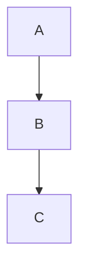

# Phase 4: Math & Diagrams — Design Spec

> **Status:** Spec only — no full implementation plan until the spike (§ "Spike before planning" below) lands. The spike's outcome decides whether we proceed with this approach, scope it down, or fold this work into a `WKWebView` migration (Phase 6).

## Goal

Render KaTeX-style math (inline `$x$`, display `$$x$$`, fenced ```` ```math ````) and Mermaid diagrams inside the existing `NSTextView` pipeline by rasterizing each block through a headless `WKWebView` and embedding the result as an `NSTextAttachment`. Keep the rest of the rendering path unchanged.

## Why rasterization, not WebKit migration

The gap analysis showed that math and diagrams are the only features that fundamentally need a browser engine. There are two ways to bring a browser engine into our pipeline:

1. **Rasterize off-screen, embed as image** — this spec.
2. **Replace `NSTextView` with `WKWebView`** — Phase 6.

(1) is incremental, keeps our text features, and only pays the WebKit cost for documents that actually contain math/diagrams. (2) is a months-long rewrite that touches the entire preview surface. We commit to (1) until the perf data forces us to (2).

Rasterization downsides (calibrated):
- **Selection** of rendered math doesn't give back the LaTeX source. Pluk's KaTeX `copy-tex` is unavailable to us in this pipeline. We can mitigate by storing the source in the attachment's `accessibilityDescription` and exposing a "Copy LaTeX" context menu item.
- **No interactivity.** Mermaid pan/zoom (pluk CHANGELOG 0.0.16) is out of reach. Acceptable; this is for QL preview, not a full app.
- **Cold start.** Spinning up a `WKWebView`, loading bundled JS, rendering, snapshotting — the first call has measurable latency. The spike measures it.

## Architecture

```
parse                  render (main actor)            present
─────                  ─────────────────────          ──────
MarkdownBlock          for block in blocks:           NSAttributedString
  .math(latex)           if .math or .mermaid:        with image attachments
  .mermaid(source)         await rasterize(block)        ↓
  ...                      append NSTextAttachment    rendered in NSTextView
```

Key new pieces:

- **`MarkdownBlock.math(latex: String, display: Bool)`** — a new parser block type for fenced ```` ```math ```` and standalone `$$...$$` paragraphs.
- **`MarkdownBlock.mermaid(source: String)`** — parser routes ```` ```mermaid ``` ```` here instead of into the generic code path.
- **Inline math** as a *post-pass* on the rendered attributed string: scan for `$...$` and `$$...$$` ranges that are not inside code attribute ranges, replace with attachment.
- **`MathDiagramRasterizer`** actor: owns a small pool of headless `WKWebView` instances, knows how to feed them KaTeX or Mermaid JS, returns `NSImage` snapshots.
- **Caching:** keyed by `(kind, source, theme, scale)` → `NSImage`. In-memory for now; if cold-start is bad, persist to `Caches/`.
- **Bundled vendor JS:** `katex.min.js`, `katex.min.css`, `mermaid.min.js` checked into `MarkdownRendering/Resources/Vendor/`. Add to the framework target's `resources:` in `project.yml`.

### Component sketch

```swift
// In MarkdownRendering:

public enum MathDisplay: Sendable { case inline, block }

public actor MathDiagramRasterizer {
    public init(scale: CGFloat = 2.0)
    public func rasterizeMath(_ latex: String, display: MathDisplay) async throws -> NSImage
    public func rasterizeMermaid(_ source: String) async throws -> NSImage
}

// Renderer becomes async-aware for these blocks:
extension MarkdownDocumentRenderer {
    public func render(
        document: MarkdownPreparedDocument,
        rasterizer: MathDiagramRasterizer
    ) async throws -> MarkdownRenderPayload
}
```

The renderer's *prepare* phase still runs off-main and emits blocks. *Render* is already `@MainActor` for the attributed-string building; rasterization awaits inside that phase. Existing call sites pass `MathDiagramRasterizer()` (or `nil` to fall back to label-only behavior).

### WebKit harness

For each block, the actor:

1. Picks an idle `WKWebView` from the pool (or creates a new one, max pool size 2).
2. Calls `loadHTMLString(_:baseURL:)` with a self-contained template:
   - Math: KaTeX-rendered LaTeX in a `<span>` sized to its content.
   - Mermaid: `mermaid.run()` over a `<pre class="mermaid">` block.
3. Waits for a `window.webkit.messageHandlers.done.postMessage()` signal (script-injected; sent after `katex.render` resolves or `mermaid.run()` completes).
4. Calls `takeSnapshot(with:)` (macOS 14+ API) to get an `NSImage`.
5. Trims transparent margin if needed.

Snapshot configuration: `WKSnapshotConfiguration.afterScreenUpdates = true`, `rect = .null` (whole content), 2x scale.

### Inline math post-pass

After the rendered `NSAttributedString` is built, the renderer scans the *plain text* for `\$([^$\n]+?)\$` and `\$\$([^$]+?)\$\$` matches that don't overlap any range with `.inlinePresentationIntent.code`. Each match becomes:

```swift
let image = try await rasterizer.rasterizeMath(latex, display: .inline)
let attachment = makeInlineAttachment(image: image, latex: latex)
attributed.replaceCharacters(in: range, with: NSAttributedString(attachment: attachment))
```

`makeInlineAttachment` baselines the image to text-baseline for inline placement.

### Failure mode

Any rasterizer error (JS exception, missing vendor file, timeout > 3s) falls back to rendering the literal LaTeX source in a monospace span. The current "🧮 Math Expression" label is replaced by either a real image *or* the source — never both.

## Per-feature acceptance criteria

### 4.1 Fenced math blocks

```markdown
```math
\int_0^1 x^2\,dx = \frac{1}{3}
```
```

**Acceptance:**
- Renders as a centered, scaled-up display-mode KaTeX image.
- Selecting the block and copying yields the LaTeX source (via attachment accessibility description + a custom paste handler if needed).
- Failure mode: literal LaTeX source in monospace.

### 4.2 Display math `$$...$$`

```markdown
The integral $$\int_0^1 x^2\,dx = \frac{1}{3}$$ is …
```

**Acceptance:**
- `$$...$$` on its own paragraph renders as a centered display image.
- `$$...$$` inline within text renders inline (display-mode image, baseline-aligned).
- `$$` inside code spans is NOT treated as math.

### 4.3 Inline math `$x$`

```markdown
We have $f(x) = x^2$ as a polynomial.
```

**Acceptance:**
- Renders inline at body text size.
- `$` inside code spans is NOT treated as math.
- Unmatched `$` (one of a pair) renders literal — no greedy match across line breaks.

### 4.4 Mermaid

```markdown

```

**Acceptance:**
- Renders as a centered image at the diagram's natural width (capped at content width).
- Syntax errors fall back to the literal source in a monospace block (NOT a crash).
- Cache hit on a re-render of the same file returns immediately (verify via instrumentation).

### 4.5 Code-fence info-string respected

This depends on Phase 1 Task 7. Confirm ```` ```mermaid {theme=dark} ```` still routes to Mermaid (after the Phase 1 first-token extraction is in place).

## Spike before planning

Before writing the implementation plan, spend 1–3 days on a spike:

**Spike goals (success = "we have enough data to plan"):**

1. Build a minimal `MathDiagramRasterizer` (single WKWebView, no pool, no cache) that rasterizes one hardcoded KaTeX expression.
2. Measure:
   - Cold-start latency (process launch → first image returned). Target: < 800ms; acceptable up to 1.5s.
   - Per-block warm latency (subsequent renders, same process). Target: < 50ms.
   - Memory growth across 50 successive renders (WKWebView leak risk). Target: stable.
3. Repeat for Mermaid with a small diagram.
4. Snapshot quality at 1x vs 2x — confirm text in Mermaid diagrams is sharp.

**Spike artifacts** (deliver as a single PR or a discarded branch):
- `MarkdownRendering/Sources/MathDiagramRasterizer.swift` — minimal skeleton.
- `MarkdownRendering/Sources/Resources/Vendor/Mermaid/mermaid.min.js`, `KaTeX/katex.min.{js,css}`.
- `Fixtures/Spike/math.md`, `Fixtures/Spike/mermaid.md`.
- A short README in `docs/superpowers/spikes/2026-XX-math-diagrams-rasterization.md` with the numbers.

**Spike decisions:**

| Outcome | Next step |
|---|---|
| Cold start < 1.5s, warm < 50ms, memory stable | Write the full Phase 4 plan; ship. |
| Cold start 1.5s–3s | Add warmup at extension launch + bigger cache; write plan with caveats. |
| Cold start > 3s OR memory grows unbounded | Stop; either accept label-only forever or escalate to Phase 6 migration. |
| Snapshot quality poor | Investigate (DPR? PDF snapshot? `WKSnapshotConfiguration.snapshotWidth`?) before planning. |

## File-level impact estimate (post-spike)

| File | Change |
|---|---|
| `MarkdownRendering/Sources/MarkdownDocumentRenderer.swift` | New block cases `.math`, `.mermaid`; inline-math post-pass; async render variant. |
| `MarkdownRendering/Sources/MathDiagramRasterizer.swift` | New actor managing WKWebView pool + JS bridge. |
| `MarkdownRendering/Sources/Resources/Vendor/{KaTeX,Mermaid}/` | Bundled JS/CSS. |
| `MarkdownRendering/Tests/MathDiagramRasterizerTests.swift` | Integration tests (render known LaTeX, compare image dims). |
| `MarkdownRendering/Tests/MarkdownDocumentRendererMathTests.swift` | Block-level tests for parser + post-pass. |
| `project.yml` | Add vendored resources to the `MarkdownRendering` target. |
| `MarkdownQuickLookPreviewExtension/PreviewLoadingCoordinator.swift` | Instantiate / pass the rasterizer to the renderer. |
| `MarkdownQuickLookThumbnailExtension/ThumbnailProvider.swift` | Either pass rasterizer (heavy for thumbnails) OR skip — thumbnails should likely just render labels. Decide during the plan. |
| `Fixtures/Pluk-Parity/math.md`, `mermaid.md` | New fixtures. |

## Out of scope

- **Interactive Mermaid pan/zoom.** Static image only. Phase 6 territory.
- **KaTeX `copy-tex` proper.** We expose the source via attachment metadata; users won't get pluk's pasteboard-format magic.
- **MathJax** as an alternative engine. KaTeX is faster to parse and good enough.
- **PlantUML, Graphviz, generic .puml.** Niche; revisit if requested.
- **Custom KaTeX macros / Mermaid themes by configuration.** Add only if requested.

## Risks

- **JS vendor bundle bloat.** KaTeX is ~280KB JS + ~25KB CSS. Mermaid is ~2.6MB. These sit in the framework bundle (which is embedded inside the extension). The extension's binary footprint grows by ~3MB. Acceptable but worth measuring.
- **`WKWebView` inside a sandboxed extension.** Sandbox typically allows WKWebView; requires `com.apple.security.network.client`? Verify during the spike.
- **Concurrent rasterization.** If two QL previews happen in close succession (unlikely but possible), the actor serializes correctly but a single WebView is a bottleneck. Pool of 2 is the cheap fix.

## When this spec becomes a plan

After the spike, the plan file at `docs/superpowers/plans/2026-XX-phase4-math-diagrams.md` should contain:

- Concrete TDD tasks for each parser change (`.math`, `.mermaid` block types).
- Concrete TDD tasks for the rasterizer, including the JS bridge contract.
- Vendor JS pinning policy (which version, where checked in).
- Caching strategy (in-memory vs disk-persisted).
- Failure-fallback acceptance tests.
- Performance regression measurements vs the pre-Phase-4 baseline.
